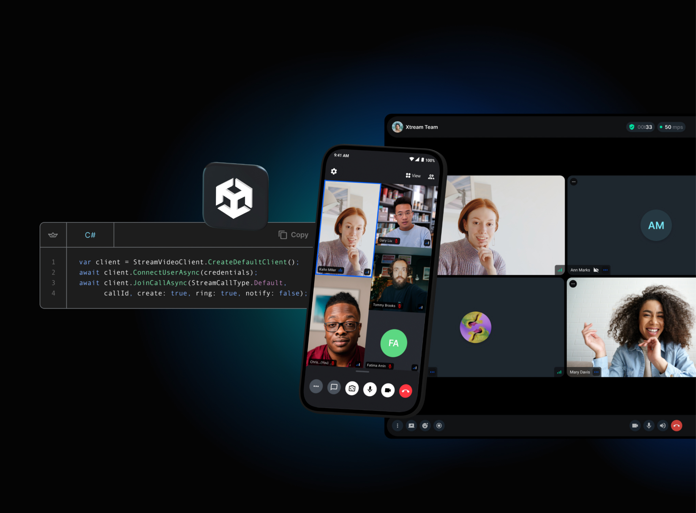

# Starting Project for Audio Rooms App in Unity Tutorial

This is a starting Unity project for [How to Build a Audio Rooms App in Unity](https://getstream.io/video/docs/unity/tutorials/audio-room/) tutorial using Stream's [Video & Audio SDK for Unity](https://github.com/GetStream/stream-video-unity).

  

## 🛥 What is Stream?

Stream allows developers to rapidly deploy scalable feeds, chat messaging and video with an industry leading 99.999% uptime SLA guarantee.

Stream provides state handling that make it easy to build video calling for your app. All calls run on Stream's network of edge servers around the world, ensuring optimal latency and reliability.